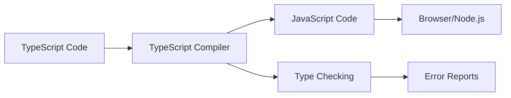

# 🚀 **What is TypeScript?**

## 🎯 **Learning Objectives**
By the end of this lesson, you will understand:
- What TypeScript is and why it exists
- The relationship between TypeScript and JavaScript
- Key benefits of using TypeScript
- When to use TypeScript in your projects

---

## 📖 **Introduction**

### **What is TypeScript?**
TypeScript is a **strongly typed programming language** that builds on JavaScript by adding **static type definitions**. It was developed by Microsoft and first released in 2012.

> **Think of TypeScript as JavaScript with superpowers! 🦸‍♂️**

### **Key Characteristics**
- ✅ **Superset of JavaScript** - All valid JavaScript is valid TypeScript
- ✅ **Compile-time type checking** - Catches errors before runtime
- ✅ **Modern JavaScript features** - Supports latest ECMAScript features
- ✅ **Optional typing** - You can gradually adopt types
- ✅ **Excellent tooling** - Amazing IDE support and IntelliSense

---

## 🔄 **TypeScript vs JavaScript**

### **JavaScript (Dynamic Typing)**
```javascript
// JavaScript - Types determined at runtime
function greet(name) {
    return "Hello " + name;
}

greet("John");        // ✅ Works
greet(42);           // ⚠️ Works but might not be intended
greet();             // ⚠️ Works but returns "Hello undefined"
```

### **TypeScript (Static Typing)**
```typescript
// TypeScript - Types checked at compile time
function greet(name: string): string {
    return "Hello " + name;
}

greet("John");        // ✅ Works perfectly
greet(42);           // ❌ Compile error: Argument of type 'number'
greet();             // ❌ Compile error: Expected 1 arguments
```

---

## ✨ **Why TypeScript?**

### **1. Early Error Detection**
```typescript
// TypeScript catches this error before your code runs
interface User {
    id: number;
    name: string;
    email: string;
}

function displayUser(user: User) {
    console.log(user.nmae); // ❌ Error: Property 'nmae' does not exist
}
```

### **2. Better IDE Support**
- 🔍 **IntelliSense** - Smart code completion
- 🔄 **Refactoring** - Safe rename and restructure
- 📋 **Documentation** - Inline type information
- 🚀 **Navigation** - Go to definition/implementation

### **3. Self-Documenting Code**
```typescript
// Types serve as documentation
function calculateTotal(
    items: Array<{price: number, quantity: number}>,
    taxRate: number = 0.08,
    discountPercent?: number
): number {
    // Implementation here
    return 0;
}
```

### **4. Easier Refactoring & Maintenance**
```typescript
// Changing this interface will show all places that need updates
interface Product {
    id: string;
    name: string;
    price: number;
    category: string; // Add new property
}
```

---

## 🏗️ **How TypeScript Works**

### **The Compilation Process**



1. **Write TypeScript** (.ts files)
2. **Compile with TSC** (TypeScript Compiler)
3. **Get JavaScript** (.js files)
4. **Run JavaScript** (in browser/Node.js)

### **Example Compilation**

**Input (TypeScript):**
```typescript
// main.ts
class Calculator {
    add(a: number, b: number): number {
        return a + b;
    }
}

const calc = new Calculator();
console.log(calc.add(5, 3));
```

**Output (JavaScript):**
```javascript
// main.js
class Calculator {
    add(a, b) {
        return a + b;
    }
}

const calc = new Calculator();
console.log(calc.add(5, 3));
```

---

## 🎯 **When to Use TypeScript?**

### **✅ Great for:**
- Large applications and teams
- Long-term projects
- APIs and libraries
- Applications requiring high reliability
- Projects with complex data structures
- When you want better IDE support

### **⚠️ Consider carefully for:**
- Small, short-term projects
- Rapid prototyping
- Simple scripts
- When team is unfamiliar with types

---

## 📊 **TypeScript Adoption**

### **Who Uses TypeScript?**
- 🏢 **Microsoft** - Created and uses it extensively
- 📘 **Facebook** - Used in many projects
- 🅰️ **Google** - Angular is built with TypeScript
- 🎵 **Spotify** - Frontend and backend applications
- 📱 **Airbnb** - Web and mobile applications

### **Industry Statistics**
- 📈 **78%** of developers love working with TypeScript
- 🚀 **40%** faster development for large codebases
- 🐛 **15%** reduction in bugs caught in production
- 💼 **60%** of JavaScript jobs prefer TypeScript experience

---

## 🤔 **Common Misconceptions**

### **❌ "TypeScript is hard to learn"**
- ✅ **Reality:** If you know JavaScript, you already know most TypeScript
- 🎯 **Tip:** Start by adding simple type annotations

### **❌ "TypeScript slows down development"**
- ✅ **Reality:** Initial setup time but faster development overall
- 🎯 **Tip:** Better error catching saves debugging time

### **❌ "TypeScript is just for large projects"**
- ✅ **Reality:** Benefits start from day one, even in small projects
- 🎯 **Tip:** Even simple type hints improve code quality

---

## 🎓 **Key Takeaways**

1. **TypeScript = JavaScript + Types** 📝
2. **Catches errors early** 🐛 → 🔍
3. **Better development experience** 🛠️
4. **Compiles to JavaScript** ⚙️ → 📜
5. **Gradual adoption possible** 🚶‍♂️ → 🏃‍♂️

---

## 🚀 **What's Next?**

In the next lesson, we'll learn how to:
- Install TypeScript on your system
- Set up your development environment
- Create your first TypeScript project
- Configure VS Code for TypeScript development

---

**Ready to start your TypeScript journey? Let's set up your environment! 🛠️**